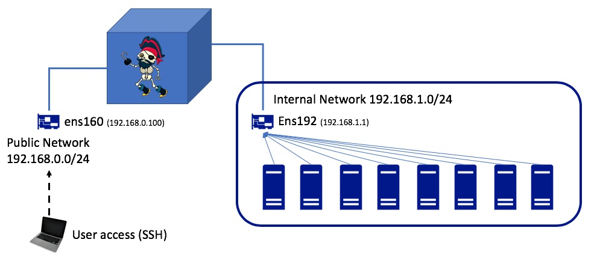

# Example architecture

This document outlines an example architecture that one can consider when structuring or designing a network that will ultimately make use of servers bootstrapped by plunder.

## Infrastructure design

In the architecture below the blue cube is the server or VM that will host Plunder and expose it's services. This machine has two adapters `ens160` and `ens192` although they could well be `eth0`/`eth1` depending on your Linux distribution. 

The adapter `ens160` is connected to a public network where a user can connect to it's exposed IP address (`192.168.0.100`) over a protocol such as SSH, in order to interact with the OS (and plunder). The second adapter `ens192` is connected to a private network, where a number of other hosts as repeatedly rebooting waiting for a bootstrap server to provision them. 



## Services Overview

The services that plunder can expose will bind to the existing operating system in two ways. 

#### DHCP

This will ultimately bind to an adapter, and this adapter should be configured with an address.

#### TFTP 

This will ultimately bind to an IP address.

#### HTTP

This will also bind to an IP address.

## Example Plunder usage

The CLI examples below don't make use of any configuration files or dynamic updates and provide a quick and easy way of exposing multiple services from Plunder.

```
sudo ./plunder server			\
--adapter ens192					\
--enableDHCP 						\
--enableTFTP 						\
--enableHTTP 						\
--initrd initrd.gz	     		\
--kernel kernel            	\
--cmdline "console=tty0" 		\
--addressDHCP 192.168.1.1 		\
--startAddress 192.168.1.130 	\
--addressTFTP 192.1.1.1 		\
--addressHTTP 192.168.1.1 		\
--anyboot  
```

To understand the CLI line above, we will break it down into what some of the more hard-to-understand flags actually are doing.

- `--adapter <...>` This specified which adapter DHCP will broadcast from
- `--enableXXXX` Enable a specific service, in most cases all will be needed unless existing services already exist.
- `--addressDHCP <x.x.x.x>` This is the address that should be configured on the adapter that you're binding too.
- `--addressTFTP/HTTP` This can either be the same address as above or an address of an existing service
- `--startAddress <x.x.x.x>` This is the beginning on the advertised DHCP addresses.

**Note** `sudo` has to be used as binding to an adapter and ports <1024 requires root privileges. 


## Example Plunder usage with Linuxkit

If you're using [LinuxKit](https://github.com/linuxkit/linuxkit) images then they can be consumed in the same way as described above. We've simply copied the created OS image files from linuxkit and copied them to our deployment server in the `~/linuxkit/` folder.   

```
sudo ./plunder server		\
--adapter ens192				\
--enableDHCP 					\
--enableTFTP 					\
--enableHTTP 					\
--initrd linuxkit/linuxkit-initrd.img        \
--kernel linuxkit/linuxkit-kernel            \
--cmdline $(cat ./linuxkit/linuxkit-cmdline) \
--addressDHCP 192.168.1.1 		\
--startAddress 192.168.1.130 	\
--addressTFTP 192.1.1.1 		\
--addressHTTP 192.168.1.1 		\
--anyboot  
```