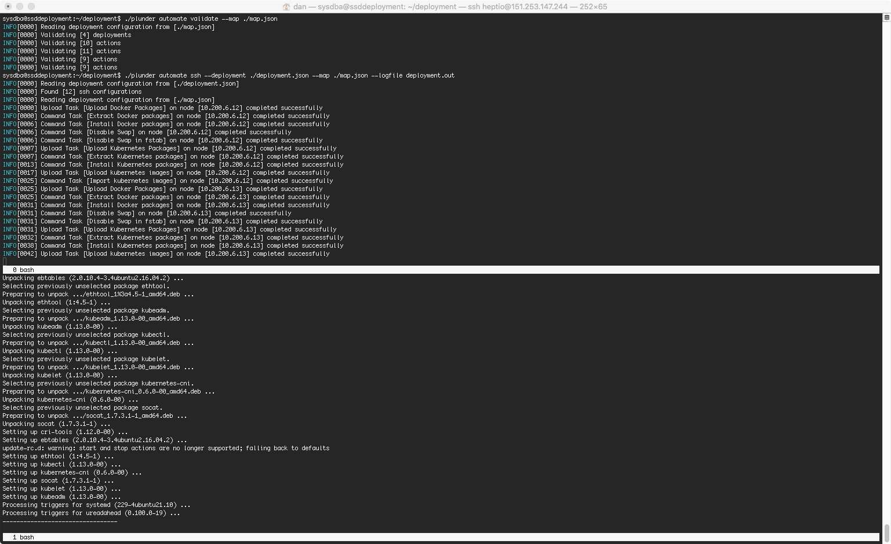

# Provisioning Configuration

The provisioning works by running remote commands or uploading/downloading files to a remote system, in order for it to be configured correctly. A parsing engine called "parlay" was writted in order to provide repeatable scripting to ease deployments.

### Example deployment script

This script below (for offline installations) will upload a tarball containing the docker packages and then install them on all remote systems listed under `hosts`.

**Note** the tarball was created by `apt-get download docker-ce=18.06.1~ce~3-0~ubuntu; tar -cvzf docker_pkg.tar.gz ./docker-ce_18.06.1~ce~3-0~ubuntu_amd64.deb`

```
{
	"deployments": [
		{
			"name": "Upload Docker Packages",
			"parallel": false,
			"sessions": 0,
			"hosts": [
				"192.168.1.3",
				"192.168.1.4",
				"192.168.1.5"
			],
			"actions": [
				{
					"name": "Upload Docker Packages",
					"type": "upload",
					"source": "./docker_pkg.tar.gz",
					"destination": "/tmp/docker_pkg.tar.gz"
				},
				{
					"name": "Extract Docker packages",
					"type": "command",
					"command": "tar -C /tmp -xvzf /tmp/docker_pkg.tar.gz"
				},
             {
					"name": "Install Docker packages",
					"type": "command",
					"command": "dpkg -i /tmp/docker/*",
					"commandSudo": "root"
				}
			]
		}
	]
}
                                
```
The above example covers simple usage of `uploading` and `command` usage.. there are some custom actions to ease Kubernetes deployment (with more coming).

## ETCD cluster deployment

**NOTE:** A previous deployment or an action is needed to ensure that `kubectl`, `kubeadm` and `kubectl` are installed on the `hosts`. Also if these hosts aren't internet facing, then an etcd container image will be neded pushing to the hosts (again this can be done through a different deployment or through additional actions in the deployment below.

```
{
	"deployments": [
		{
			"name": "Provision initial etcd cluster",
			"parallel": false,
			"sessions": 0,
			"hosts": [
				"192.168.1.3"
			],
			"actions": [
				{
					"name": "Upload Docker Packages",
					"type": "etcd",
					"etcd" : {
						"hostname1" : "etcd01",
						"hostname2" : "etcd02",
						"hostname3" : "etcd03",
						"address1" : "192.168.1.3",
						"address2" : "192.168.1.4",
						"address3" : "192.168.1.5",
						"initCa" : false
					}
				}
			]
		}
	]
}
```

The action `type` of `etcd` will automate the provisioning of all of the certificates required along with building the correct `kubeadmcfg.yaml` needed for the etcd cluster to be provisioned correctly.

The `initCa` should be set to `true` in the event that a new certificate authority is required.

It will finally download all of the certificates for `etcd02` and `etcd03` in a tarballs to the machine where `plunder` is running. 

An additional deployment would then `upload` these tarballs to the correct hosts and for example
run the command `kubeadm init phase etcd local --config=/tmp/192.168.1.4/kubeadmcfg.yaml`.

## Usage

When automating a deployment ssh credentials are required to map a host with the correct credentials. To simplify this `plunder` can make use of the deployment file to determine access credentials. When the deployment begins `plunder` will evaluate the hosts in the provisioning map and identify the correct credentials from the deployment file. 

`plunder automate ssh --config ./deployment.json --map ./etcd.json --logfile output`


*The above example uses screen, where the output from `plunder` is on the top and `tail -f output` is below*

Additional flags:

- The `--deployment` flag now will point to a specific deployment in a map
- The `--action` flag can be used to point to a specific action in a deployment
- The `--host` flag will point to a specific host in the deployment
- The `--resume` will determine if to continue executing all remaining actions